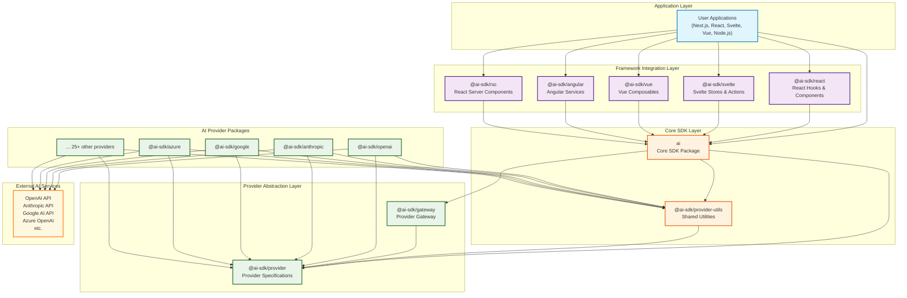
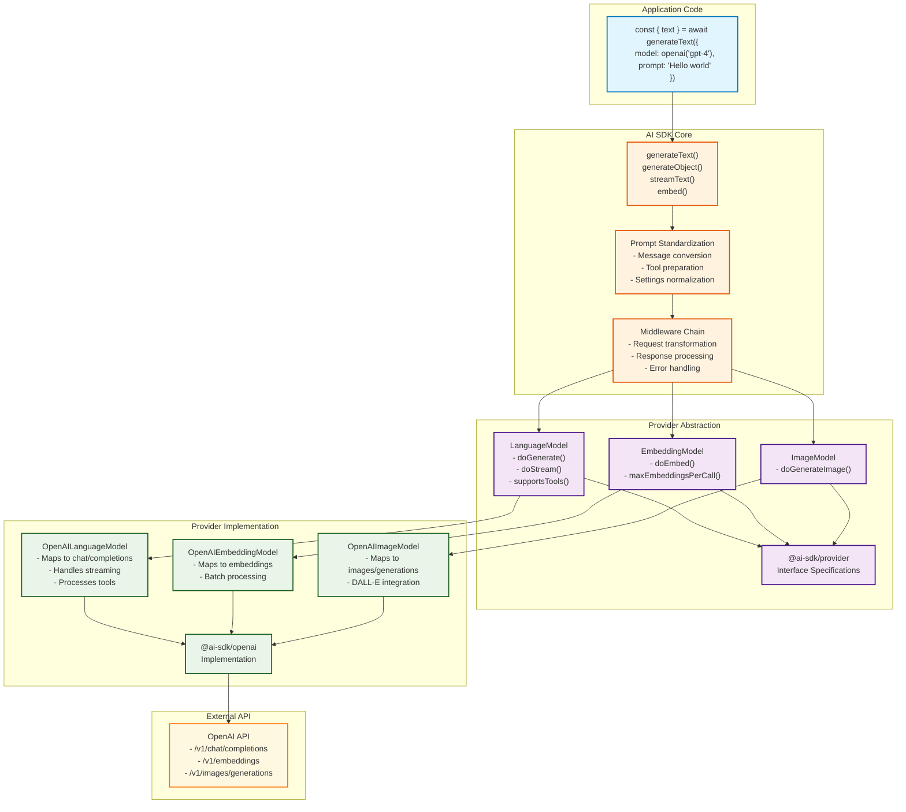
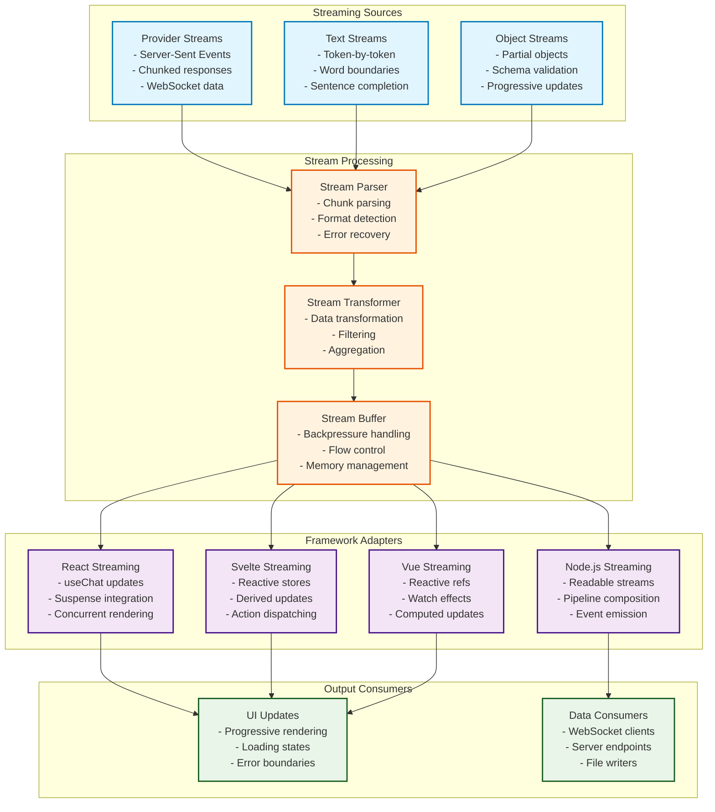
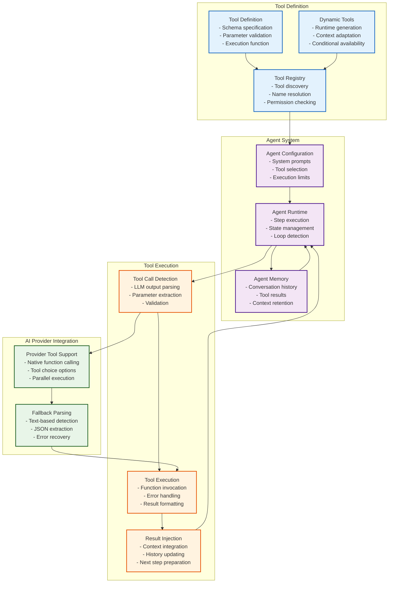
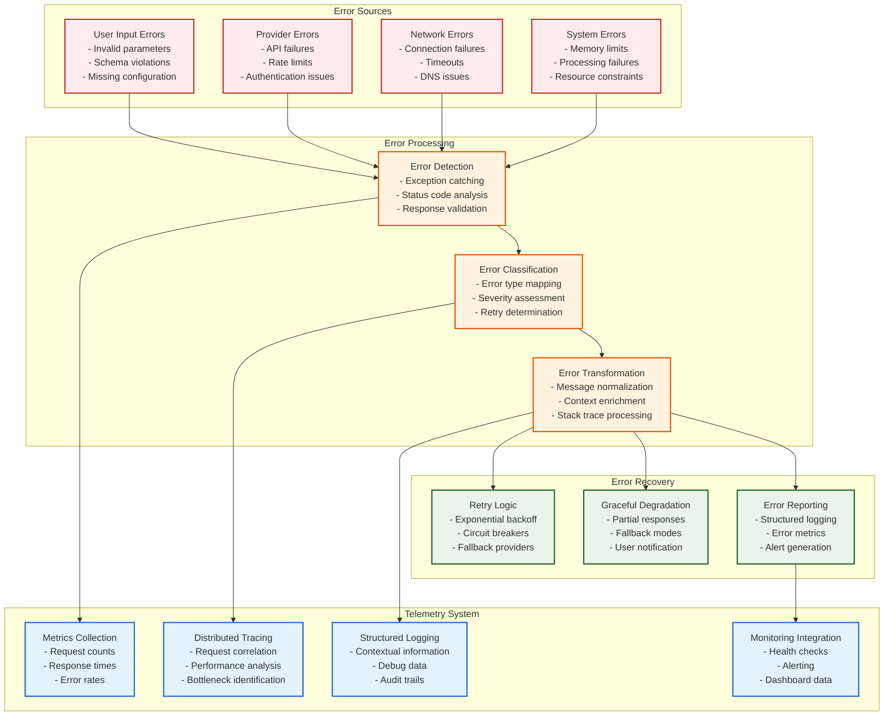
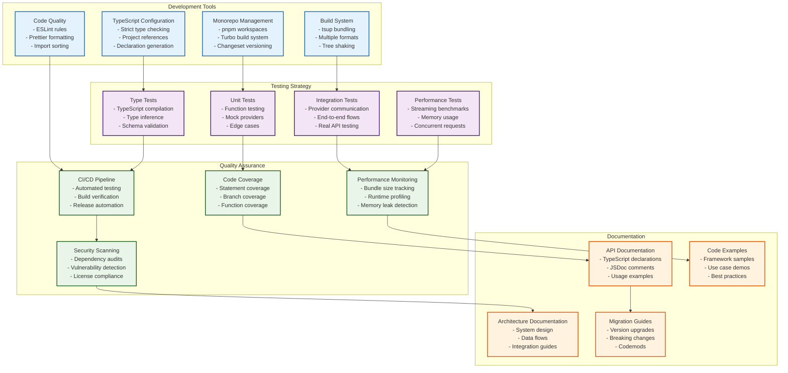

# AI SDK Technical Architecture

This document provides a comprehensive overview of the AI SDK's technical architecture, including system design, package organization, data flows, and integration patterns.

## Table of Contents

1. [System Overview](#system-overview)
2. [Package Architecture](#package-architecture)
3. [Provider Architecture](#provider-architecture)
4. [Framework Integration Architecture](#framework-integration-architecture)
5. [Data Flow and Processing](#data-flow-and-processing)
6. [Streaming Architecture](#streaming-architecture)
7. [Tool and Agent System](#tool-and-agent-system)
8. [Error Handling and Telemetry](#error-handling-and-telemetry)
9. [Development and Testing Architecture](#development-and-testing-architecture)

## System Overview

The AI SDK is a comprehensive TypeScript toolkit designed to simplify building AI-powered applications across multiple frameworks and AI providers. The architecture follows a modular, provider-agnostic approach with clear separation of concerns.

### Key Architectural Principles

1. **Provider Agnostic**: Unified interface across all AI providers
2. **Framework Flexible**: Support for React, Svelte, Vue, Angular, and vanilla JavaScript/TypeScript
3. **Type Safe**: Full TypeScript support with comprehensive type definitions
4. **Streaming First**: Built-in support for real-time streaming responses
5. **Modular Design**: Each package serves a specific purpose with minimal dependencies
6. **Developer Experience**: Consistent APIs and comprehensive error handling

## Package Architecture

The AI SDK is organized as a monorepo with over 40 packages, each serving specific functionality:

```mermaid
graph TD
    subgraph "Core Packages"
        AI["ai<br/>Main SDK Package<br/>- generateText()<br/>- generateObject()<br/>- streamText()<br/>- embed()"]
        PROVIDER["@ai-sdk/provider<br/>Provider Specifications<br/>- Language Models<br/>- Embedding Models<br/>- Image Models"]
        UTILS["@ai-sdk/provider-utils<br/>Shared Utilities<br/>- Schema validation<br/>- Tool definitions<br/>- ID generation"]
    end

    subgraph "Framework Integrations"
        REACT["@ai-sdk/react<br/>- useChat()<br/>- useCompletion()<br/>- useObject()"]
        SVELTE["@ai-sdk/svelte<br/>- chat stores<br/>- completion stores<br/>- object stores"]
        VUE["@ai-sdk/vue<br/>- chat composables<br/>- completion composables<br/>- object composables"]
        ANGULAR["@ai-sdk/angular<br/>- chat services<br/>- completion services<br/>- object services"]
        RSC["@ai-sdk/rsc<br/>React Server Components<br/>- Server-side rendering<br/>- Streaming support"]
    end

    subgraph "AI Provider Packages"
        OPENAI["@ai-sdk/openai<br/>OpenAI GPT Models<br/>DALL-E, Whisper"]
        ANTHROPIC["@ai-sdk/anthropic<br/>Claude Models"]
        GOOGLE["@ai-sdk/google<br/>Gemini Models<br/>Vertex AI"]
        AZURE["@ai-sdk/azure<br/>Azure OpenAI Service"]
        COHERE["@ai-sdk/cohere<br/>Cohere Models"]
        MISTRAL["@ai-sdk/mistral<br/>Mistral Models"]
        OTHERS["25+ Other Providers<br/>- AWS Bedrock<br/>- Hugging Face<br/>- Local models<br/>- etc."]
    end

    subgraph "Specialized Packages"
        GATEWAY["@ai-sdk/gateway<br/>Provider Gateway<br/>- Fallback handling<br/>- Load balancing"]
        LANGCHAIN["@ai-sdk/langchain<br/>LangChain Integration"]
        LLAMAINDEX["@ai-sdk/llamaindex<br/>LlamaIndex Integration"]
        CODEMOD["@ai-sdk/codemod<br/>Migration Tools"]
    end

    AI --> PROVIDER
    AI --> UTILS
    AI --> GATEWAY

    REACT --> AI
    SVELTE --> AI
    VUE --> AI
    ANGULAR --> AI
    RSC --> AI

    OPENAI --> PROVIDER
    ANTHROPIC --> PROVIDER
    GOOGLE --> PROVIDER
    AZURE --> PROVIDER
    COHERE --> PROVIDER
    MISTRAL --> PROVIDER
    OTHERS --> PROVIDER

    OPENAI --> UTILS
    ANTHROPIC --> UTILS
    GOOGLE --> UTILS
    AZURE --> UTILS
    COHERE --> UTILS
    MISTRAL --> UTILS
    OTHERS --> UTILS

    GATEWAY --> PROVIDER
    GATEWAY --> UTILS

    LANGCHAIN --> AI
    LLAMAINDEX --> AI

    classDef core fill:#e3f2fd,stroke:#1565c0,stroke-width:3px
    classDef framework fill:#f3e5f5,stroke:#4a148c,stroke-width:2px
    classDef provider fill:#e8f5e8,stroke:#1b5e20,stroke-width:2px
    classDef special fill:#fff3e0,stroke:#e65100,stroke-width:2px

    class AI,PROVIDER,UTILS core
    class REACT,SVELTE,VUE,ANGULAR,RSC framework
    class OPENAI,ANTHROPIC,GOOGLE,AZURE,COHERE,MISTRAL,OTHERS provider
    class GATEWAY,LANGCHAIN,LLAMAINDEX,CODEMOD special
```

### Package Dependency Rules

1. **Core packages** (`ai`, `@ai-sdk/provider`, `@ai-sdk/provider-utils`) form the foundation
2. **Provider packages** depend only on core packages, never on each other
3. **Framework packages** depend on the core `ai` package
4. **Specialized packages** may depend on multiple layers but maintain clear boundaries

## Provider Architecture

The provider architecture implements the adapter pattern to support multiple AI services through a unified interface:

### Provider Implementation Pattern

Each provider package follows a consistent structure:

1. **Provider Factory**: Creates configured instances (`openai()`, `anthropic()`, etc.)
2. **Model Implementations**: Implement the standard interfaces
3. **API Client**: Handles HTTP communication with the external service
4. **Error Mapping**: Converts provider-specific errors to standard formats
5. **Feature Support**: Declares supported capabilities (tools, streaming, etc.)

## Framework Integration Architecture

The AI SDK provides framework-specific packages that adapt the core functionality to each framework's patterns:

```mermaid
graph TB
    subgraph "React Integration"
        USE_CHAT["useChat()<br/>- Chat state management<br/>- Message handling<br/>- Real-time updates"]
        USE_COMPLETION["useCompletion()<br/>- Text generation<br/>- Streaming support<br/>- Loading states"]
        USE_OBJECT["useObject()<br/>- Structured generation<br/>- Type safety<br/>- Validation"]
        REACT_STREAM["React Stream Components<br/>- Server streaming<br/>- Suspense integration"]
    end

    subgraph "Svelte Integration"
        CHAT_STORE["Chat Stores<br/>- Reactive state<br/>- Derived values<br/>- Actions"]
        COMPLETION_STORE["Completion Stores<br/>- Reactive text<br/>- Loading indicators<br/>- Error handling"]
        OBJECT_STORE["Object Stores<br/>- Structured state<br/>- Schema validation<br/>- Type inference"]
    end

    subgraph "Vue Integration"
        CHAT_COMPOSABLE["useChat()<br/>- Composition API<br/>- Reactive refs<br/>- Computed properties"]
        COMPLETION_COMPOSABLE["useCompletion()<br/>- Reactive state<br/>- Watch effects<br/>- Error handling"]
        OBJECT_COMPOSABLE["useObject()<br/>- Type-safe refs<br/>- Validation<br/>- Computed schemas"]
    end

    subgraph "Core AI SDK"
        CORE_API["generateText()<br/>streamText()<br/>generateObject()<br/>embed()"]
        STREAM_API["Text Streams<br/>Object Streams<br/>Message Streams"]
    end

    USE_CHAT --> CORE_API
    USE_COMPLETION --> CORE_API
    USE_OBJECT --> CORE_API
    REACT_STREAM --> STREAM_API

    CHAT_STORE --> CORE_API
    COMPLETION_STORE --> CORE_API
    OBJECT_STORE --> CORE_API

    CHAT_COMPOSABLE --> CORE_API
    COMPLETION_COMPOSABLE --> CORE_API
    OBJECT_COMPOSABLE --> CORE_API

    classDef react fill:#61dafb,stroke:#20232a,stroke-width:2px,color:#20232a
    classDef svelte fill:#ff3e00,stroke:#ffffff,stroke-width:2px,color:#ffffff
    classDef vue fill:#4fc08d,stroke:#2c3e50,stroke-width:2px,color:#2c3e50
    classDef core fill:#fff3e0,stroke:#e65100,stroke-width:2px

    class USE_CHAT,USE_COMPLETION,USE_OBJECT,REACT_STREAM react
    class CHAT_STORE,COMPLETION_STORE,OBJECT_STORE svelte
    class CHAT_COMPOSABLE,COMPLETION_COMPOSABLE,OBJECT_COMPOSABLE vue
    class CORE_API,STREAM_API core
```

### Framework-Specific Patterns

Each framework integration follows the framework's conventions:

- **React**: Hooks for state management, Suspense for loading states, Server Components for SSR
- **Svelte**: Stores for reactive state, actions for mutations, derived stores for computed values
- **Vue**: Composables for the Composition API, reactive refs, computed properties
- **Angular**: Services for dependency injection, observables for reactive patterns

## Data Flow and Processing

The AI SDK implements a sophisticated data processing pipeline that handles requests and responses across multiple stages:

```mermaid
graph TD
    subgraph "Request Processing"
        INPUT["User Input<br/>- Prompt/Messages<br/>- Configuration<br/>- Tools/Schema"]
        VALIDATE["Input Validation<br/>- Type checking<br/>- Schema validation<br/>- Parameter limits"]
        STANDARDIZE["Prompt Standardization<br/>- Message format<br/>- Tool definitions<br/>- Call settings"]
        MIDDLEWARE_REQ["Request Middleware<br/>- Authentication<br/>- Rate limiting<br/>- Logging"]
    end

    subgraph "Provider Communication"
        PROVIDER_MAP["Provider Mapping<br/>- Format conversion<br/>- Feature adaptation<br/>- API specifics"]
        HTTP_CLIENT["HTTP Client<br/>- Request construction<br/>- Connection pooling<br/>- Retry logic"]
        EXTERNAL_API["External AI API<br/>- OpenAI<br/>- Anthropic<br/>- Google AI<br/>- etc."]
    end

    subgraph "Response Processing"
        HTTP_RESPONSE["HTTP Response<br/>- Status validation<br/>- Content parsing<br/>- Error detection"]
        PROVIDER_PARSE["Provider Response Parsing<br/>- Format normalization<br/>- Content extraction<br/>- Metadata processing"]
        MIDDLEWARE_RES["Response Middleware<br/>- Transformation<br/>- Caching<br/>- Telemetry"]
        STANDARDIZE_RES["Response Standardization<br/>- Unified format<br/>- Type safety<br/>- Error mapping"]
    end

    subgraph "Output Delivery"
        STREAM_PROC["Stream Processing<br/>- Chunk handling<br/>- Real-time updates<br/>- Backpressure"]
        TYPE_INFERENCE["Type Inference<br/>- Schema validation<br/>- Type casting<br/>- Error reporting"]
        OUTPUT["Final Output<br/>- Typed results<br/>- Streaming data<br/>- Error objects"]
    end

    INPUT --> VALIDATE
    VALIDATE --> STANDARDIZE
    STANDARDIZE --> MIDDLEWARE_REQ
    MIDDLEWARE_REQ --> PROVIDER_MAP
    PROVIDER_MAP --> HTTP_CLIENT
    HTTP_CLIENT --> EXTERNAL_API

    EXTERNAL_API --> HTTP_RESPONSE
    HTTP_RESPONSE --> PROVIDER_PARSE
    PROVIDER_PARSE --> MIDDLEWARE_RES
    MIDDLEWARE_RES --> STANDARDIZE_RES

    STANDARDIZE_RES --> STREAM_PROC
    STREAM_PROC --> TYPE_INFERENCE
    TYPE_INFERENCE --> OUTPUT

    classDef request fill:#e3f2fd,stroke:#1565c0,stroke-width:2px
    classDef provider fill:#e8f5e8,stroke:#1b5e20,stroke-width:2px
    classDef response fill:#fff3e0,stroke:#e65100,stroke-width:2px
    classDef output fill:#f3e5f5,stroke:#4a148c,stroke-width:2px

    class INPUT,VALIDATE,STANDARDIZE,MIDDLEWARE_REQ request
    class PROVIDER_MAP,HTTP_CLIENT,EXTERNAL_API provider
    class HTTP_RESPONSE,PROVIDER_PARSE,MIDDLEWARE_RES,STANDARDIZE_RES response
    class STREAM_PROC,TYPE_INFERENCE,OUTPUT output
```

### Processing Stages

1. **Input Processing**: Validation and standardization of user inputs
2. **Provider Adaptation**: Converting standardized requests to provider-specific formats
3. **HTTP Communication**: Reliable transmission with error handling and retries
4. **Response Processing**: Parsing and normalizing provider responses
5. **Output Generation**: Type-safe delivery with streaming support

## Streaming Architecture

The AI SDK is built with streaming as a first-class citizen, supporting real-time data processing:

### Streaming Features

- **Real-time Updates**: Progressive rendering of AI responses
- **Backpressure Handling**: Automatic flow control for overwhelmed consumers
- **Error Recovery**: Graceful handling of stream interruptions
- **Memory Efficiency**: Bounded memory usage regardless of response size
- **Framework Integration**: Native streaming support for each UI framework

## Tool and Agent System

The AI SDK includes a sophisticated tool and agent system for complex AI interactions:

### Tool System Features

- **Type-Safe Tools**: Full TypeScript support for tool inputs and outputs
- **Dynamic Tool Generation**: Runtime tool creation based on context
- **Multi-Step Agents**: Complex workflows with multiple tool interactions
- **Provider Compatibility**: Support for both native and fallback tool calling
- **Error Resilience**: Graceful handling of tool execution failures

## Error Handling and Telemetry

The AI SDK implements comprehensive error handling and observability:

### Observability Features

- **Comprehensive Error Handling**: Structured error types with context
- **Automatic Retry Logic**: Intelligent retry strategies with exponential backoff
- **Telemetry Integration**: Built-in metrics, tracing, and logging
- **Performance Monitoring**: Request timing, throughput, and error rate tracking
- **Debugging Support**: Detailed error messages and diagnostic information

## Development and Testing Architecture

The AI SDK maintains high code quality through comprehensive development and testing infrastructure:

### Development Practices

- **Monorepo Architecture**: Unified development with shared tooling
- **Type-First Development**: TypeScript-first approach with strict type checking
- **Comprehensive Testing**: Unit, integration, type, and performance tests
- **Automated Quality Gates**: CI/CD pipeline with quality checks
- **Living Documentation**: Up-to-date docs with examples and migration guides

---

## Contributing to the Architecture

This documentation is maintained alongside the codebase. When making architectural changes:

1. Update the relevant diagrams and descriptions
2. Ensure examples reflect current API patterns
3. Update cross-references and navigation
4. Test all Mermaid diagrams render correctly
5. Review with the core team for accuracy

For questions or suggestions about the architecture, please open an issue or discussion in the repository.
